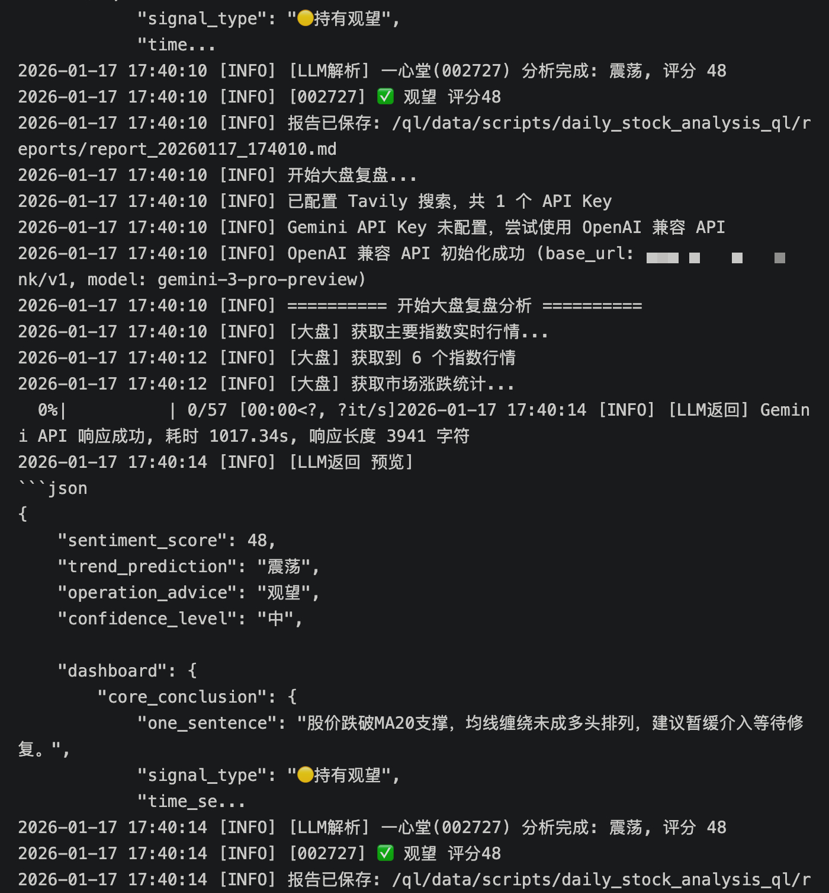
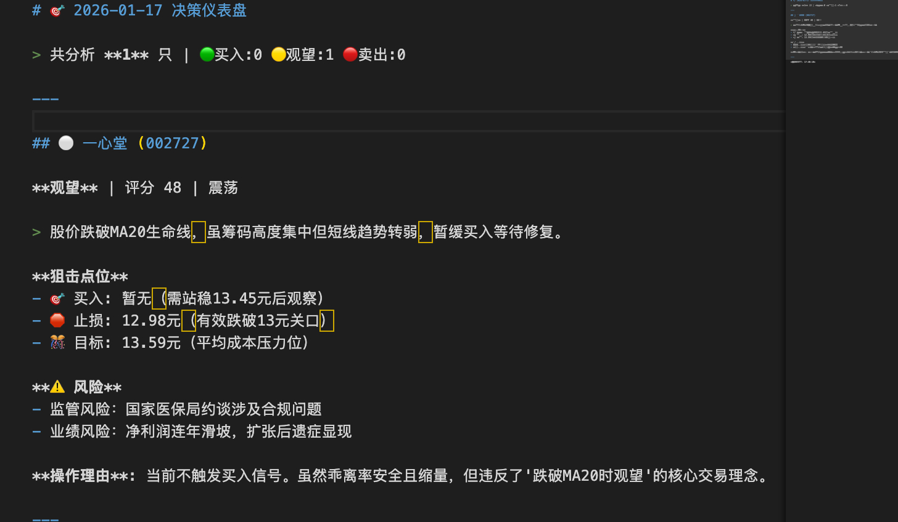
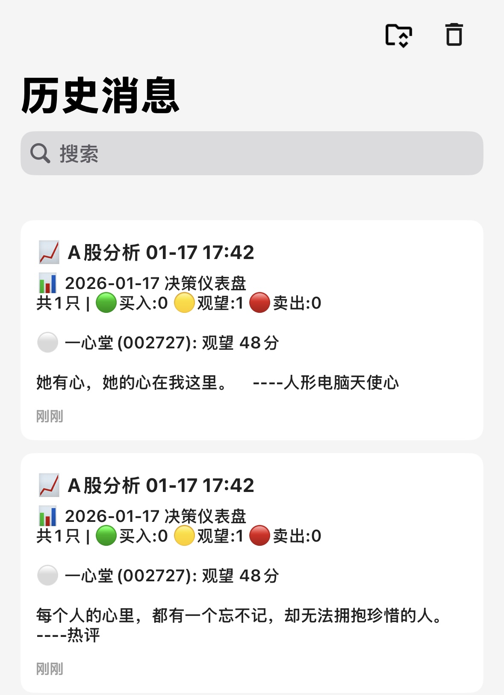

# 📈 A股智能分析系统 (青龙版)

[](https://www.python.org/)
[](https://github.com/whyour/qinglong)
[](https://github.com/ZhuLinsen/daily_stock_analysis)

> 🙏 本项目基于 [daily_stock_analysis](https://github.com/ZhuLinsen/daily_stock_analysis) 改造，感谢原作者 [@ZhuLinsen](https://github.com/ZhuLinsen)！主要适配**青龙面板**定时任务和消息推送。

专为青龙面板设计的 A 股智能分析系统，结合技术面分析、筹码分布、新闻搜索和 AI 大模型，生成"决策仪表盘"报告。

---

## 📸 效果预览

|               运行日志                |                分析报告                 |              消息推送               |
| :-----------------------------------: | :-------------------------------------: | :---------------------------------: |
|  |  |  |

---

## 🚀 快速开始

### 1. 拉取代码

**方式一：青龙订阅（推荐）**

青龙面板 → 订阅管理 → 新建订阅：

```
名称：A股智能分析
链接：https://github.com/uniqueque/daily_stock_analysis_ql.git
定时：0 18 * * 1-5
白名单：ql_main.py
```

**方式二：手动克隆**

```bash
cd /ql/scripts
git clone https://github.com/uniqueque/daily_stock_analysis_ql.git
```

### 2. 安装依赖

青龙面板 → 依赖管理 → Python3 → 新建依赖：

```
tenacity akshare pandas numpy google-generativeai openai tavily-python requests fake-useragent
```

### 3. 配置环境变量

青龙面板 → 环境变量 → 新建变量：

| 变量名            |  必填  | 说明                 | 示例                          |
| ----------------- | :----: | -------------------- | ----------------------------- |
| `STOCK_LIST`      |   ✅   | 股票代码（逗号分隔） | `600519,300750,000001`        |
| `GEMINI_API_KEY`  | 二选一 | Google Gemini Key    | `AIzaSy...`                   |
| `OPENAI_API_KEY`  | 二选一 | OpenAI 兼容 Key      | `sk-...`                      |
| `OPENAI_BASE_URL` |        | 自定义 API 地址      | `https://api.deepseek.com/v1` |
| `BARK_PUSH`       |        | Bark 推送地址        | `https://api.day.app/xxx`     |

> 💡 更多推送渠道（钉钉、企业微信、Telegram 等）配置见 `notify.py`

### 4. 运行

青龙面板 → 定时任务 → 找到 `ql_main.py` → 点击运行

---

## 📊 核心功能

- **AI 决策仪表盘**：买入/卖出信号、狙击点位、风险提示
- **技术面分析**：MA 均线排列、乖离率、量能、筹码分布
- **联网搜索**：自动获取个股近期新闻和公告
- **多模型支持**：Gemini / OpenAI / DeepSeek 等
- **消息推送**：支持 20+ 种推送渠道

---

## ⚠️ 免责声明

本系统仅供技术交流，**不构成投资建议**。投资有风险，据此操作风险自担。

---

## 📄 开源协议

[MIT License](LICENSE)
